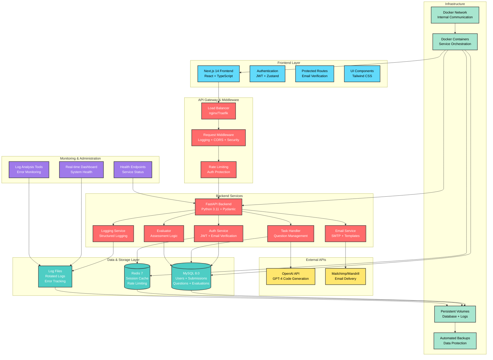
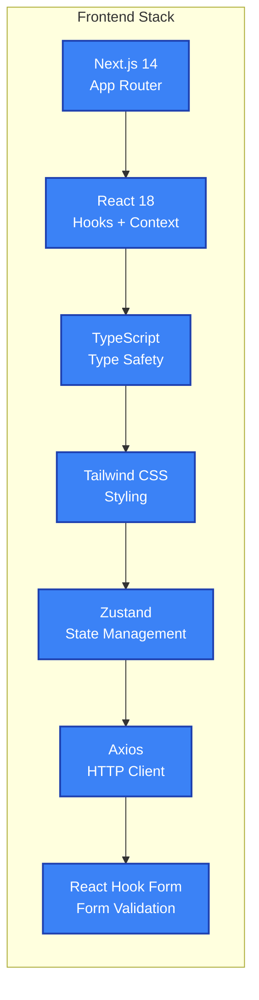
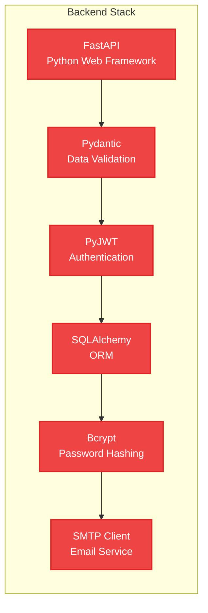
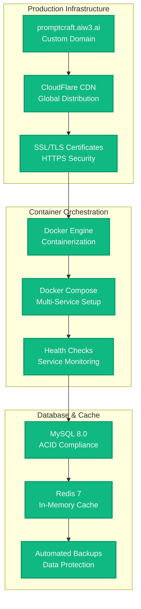
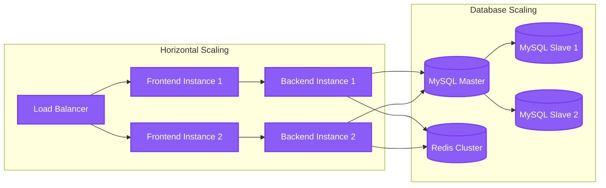

# PromptCraft 🚀

[](https://opensource.org/licenses/Apache-2.0)
[](https://www.docker.com/)
[](https://nextjs.org/)
[](https://fastapi.tiangolo.com/)
[](https://www.mysql.com/)

A comprehensive web-based framework for assessing and evaluating "prompting proficiency" in technical interviews - the ability to effectively instruct AI language models for code generation.

## 🎯 Overview

PromptCraft is designed for technical interviewers and hiring managers who want to evaluate a candidate's ability to leverage AI tools effectively. In an era where Large Language Models (LLMs) can generate code, the bottleneck is shifting towards the human's capacity to articulate clear, specific, and intelligent instructions.

**Live Demo:** 
- 🌐 **Frontend:** [https://promptcraft.aiw3.ai](https://promptcraft.aiw3.ai)
- 🔗 **API:** [https://promptcraft-api.aiw3.ai](https://promptcraft-api.aiw3.ai)
- 📚 **API Docs:** [https://promptcraft-api.aiw3.ai/docs](https://promptcraft-api.aiw3.ai/docs)

## ✨ Core Features

### 🔐 **Authentication & User Management**
- ✅ Secure user registration and login with email verification
- ✅ JWT-based authentication with access & refresh tokens
- ✅ **Email verification system** with automatic verification emails
- ✅ **Mailchimp/Mandrill SMTP integration** for reliable email delivery
- ✅ **Password hashing** with bcrypt salt rounds
- ✅ **Protected routes** and API endpoints with middleware
- ✅ **User profile management** with verification status tracking
- ✅ **Email resend functionality** for failed deliveries

### 📚 **Question Management System**
- ✅ Browse prompting challenges by difficulty and language
- ✅ Detailed question descriptions with evaluation criteria
- ✅ Question metadata (difficulty, language, estimated time)
- ✅ Interactive question filtering and search
- ✅ Question preview with submission guidelines

### 💻 **Interactive Submission Interface**
- ✅ Real-time prompt submission with live preview
- ✅ **AI code generation** via OpenAI API integration
- ✅ **Database-persistent submission storage** (MySQL-based)
- ✅ **Submission history tracking** and management
- ✅ Code syntax highlighting and formatting
- ✅ Character counting and validation
- ✅ Draft saving and auto-recovery
- ✅ **Comprehensive error handling** with request ID tracking

### 📊 **Evaluation & Analytics Dashboard**
- ✅ Expert evaluation interface with scoring rubrics
- ✅ Structured feedback system with detailed comments
- ✅ Progress tracking and performance analytics
- ✅ Evaluation criteria breakdown
- ✅ Comparative analysis tools

### 🎨 **Modern UI/UX**
- ✅ Responsive design optimized for all devices
- ✅ Dark/light mode support
- ✅ Real-time notifications and status updates
- ✅ Loading states and comprehensive error handling
- ✅ Accessible components following WCAG guidelines
- ✅ Professional design with Tailwind CSS

### 📧 **Email Integration & Notifications**
- ✅ **Mailchimp/Mandrill SMTP integration** with TLS security
- ✅ **Professional email verification templates** (HTML + text)
- ✅ **Automated email verification** upon user registration
- ✅ **Email verification enforcement** (login blocked until verified)
- ✅ **Email resend functionality** for failed deliveries
- ✅ **Comprehensive email logging** with delivery status tracking
- ✅ **Email template customization** with company branding

### 🔧 **System Administration & Monitoring**
- ✅ **Comprehensive logging system** with file rotation (10MB/5MB limits)
- ✅ **Real-time monitoring dashboard** with live metrics
- ✅ **Error handling with custom exceptions** and structured responses
- ✅ **Request/response logging** with unique request IDs
- ✅ **Health check endpoints** for system monitoring
- ✅ **Database persistence** with Docker volumes
- ✅ **Log analysis tools** with automated monitoring scripts

## 🏗️ Architecture Overview



## 🛠️ Technology Stack

### **Frontend Technologies**


### **Backend Technologies**


### **Infrastructure & DevOps**


## 🚀 Quick Start

### Prerequisites
- **Docker & Docker Compose** (v2.0+)
- **Git** (latest version)
- **4GB RAM minimum** (8GB recommended)
- **Available ports:** 3000, 8000, 3306, 6379

### 1. Clone & Setup
```bash
# Clone the repository
git clone https://github.com/your-username/PromptCraft.git
cd PromptCraft

# Setup environment variables
cp .env.example .env
# Edit .env with your configurations (see Environment Setup below)
nano .env
```

### 2. Environment Setup
```bash
# Required Environment Variables
cat > .env << 'EOF'
# Application Configuration
LOG_LEVEL=INFO

# Database Configuration
MYSQL_ROOT_PASSWORD=your_secure_root_password
MYSQL_DATABASE=promptcraft_db
MYSQL_USER=promptcraft_user
MYSQL_PASSWORD=your_secure_password
MYSQL_PORT=3306

# Redis Configuration
REDIS_PORT=6379

# OpenAI Configuration (required for AI features)
OPENAI_API_KEY=your_openai_api_key_here

# Mailchimp Email Configuration
MAILCHIMP_API_KEY=your_mailchimp_api_key
MAILCHIMP_SERVER_PREFIX=us11
SMTP_HOST=smtp.mandrillapp.com
SMTP_PORT=587
SMTP_USERNAME=your_mailchimp_username
SMTP_PASSWORD=your_mailchimp_api_key
SMTP_USE_TLS=True
FROM_EMAIL=noreply@yourdomain.com
FROM_NAME=PromptCraft

# Frontend Configuration
NEXT_PUBLIC_API_URL=http://localhost:8000/api/v1

# Security (generate strong secrets)
JWT_SECRET_KEY=your_jwt_secret_key_min_32_characters
EOF
```

### 3. Launch Application
```bash
# Start the complete stack (recommended)
docker-compose up --build -d

# Check service status
docker-compose ps

# View logs
docker-compose logs -f

# Access the application
echo "🌐 Frontend: http://localhost:3000"
echo "🔗 Backend API: http://localhost:8000"
echo "📚 API Documentation: http://localhost:8000/docs"
```

### 4. Verify Installation
```bash
# Test backend health
curl http://localhost:8000/health

# Test frontend accessibility
curl -I http://localhost:3000

# Check database connectivity
docker-compose exec backend python -c "from promptcraft.database.db_handler import DatabaseHandler; print('✅ Database connected!')"

# Test Redis cache
docker-compose exec redis_cache redis-cli ping
```

## 📖 Usage Guide

### **For Candidates (Interview Participants)**

1. **Account Creation**
   ```bash
   # Visit http://localhost:3000/auth/register
   # Or use the live demo: https://promptcraft.aiw3.ai/auth/register
   ```
   - Create account with email verification
   - Complete profile setup
   - Access dashboard upon verification

2. **Browse Available Questions**
   - Navigate to Questions section
   - Filter by difficulty (Beginner, Intermediate, Advanced)
   - Filter by programming language (Python, JavaScript, Java, etc.)
   - Review question requirements and evaluation criteria

3. **Submit Solutions**
   - Select a question to attempt
   - Read the problem description carefully
   - Craft your prompt in the submission interface
   - Test with AI code generation
   - Submit when satisfied with results

4. **Track Progress**
   - View submission history
   - Monitor evaluation status
   - Review expert feedback
   - Analyze performance metrics

### **For Evaluators (Technical Interviewers)**

1. **Access Evaluation Dashboard**
   ```bash
   # Navigate to /evaluations or /dashboard
   ```
   - Review pending submissions
   - Access candidate profiles
   - View submission details

2. **Conduct Evaluations**
   - Examine candidate prompts
   - Review AI-generated responses
   - Score based on evaluation criteria:
     - Clarity of instructions
     - Technical accuracy
     - Problem-solving approach
     - Prompt optimization

3. **Provide Feedback**
   - Add detailed comments
   - Suggest improvements
   - Rate overall prompting proficiency
   - Submit evaluation results

### **For Administrators**

1. **Question Management**
   ```bash
   # Access admin panel (requires admin privileges)
   ```
   - Add new assessment questions
   - Modify existing questions
   - Set difficulty levels and metadata
   - Configure evaluation criteria

2. **User Management**
   - Monitor user registrations
   - Manage user permissions
   - Handle support requests
   - Export user data

3. **System Monitoring**
   - Monitor application performance
   - Check service health
   - Review error logs
   - Manage database backups

## 🚢 Deployment

### **Development Deployment**
```bash
# Start development environment with hot-reload
docker-compose up --build -d

# View real-time logs
docker-compose logs -f

# Restart specific services
docker-compose restart backend frontend

# Stop all services
docker-compose down
```

### **Production Deployment**

#### **Docker Production Setup**
```bash
# Set production environment variables
export NEXT_PUBLIC_API_URL_PROD=https://promptcraft-api.aiw3.ai/api/v1
export MYSQL_ROOT_PASSWORD_PROD=your_ultra_secure_password
export MYSQL_PASSWORD_PROD=your_ultra_secure_password
export JWT_SECRET_KEY_PROD=your_production_jwt_secret_64_chars_minimum

# Deploy production stack
docker-compose -f docker-compose.prod.yml up --build -d

# Monitor deployment
docker-compose -f docker-compose.prod.yml logs -f
```

#### **Cloud Platform Deployment**

**AWS ECS Deployment**
```bash
# Install AWS CLI and Docker Compose CLI
curl -L https://raw.githubusercontent.com/docker/compose-cli/main/scripts/install/install_linux.sh | sh

# Create ECS context
docker context create ecs promptcraft-prod

# Deploy to ECS
docker --context promptcraft-prod compose up
```

**Google Cloud Run**
```bash
# Build and push images
gcloud builds submit --tag gcr.io/PROJECT-ID/promptcraft-backend
gcloud builds submit --tag gcr.io/PROJECT-ID/promptcraft-frontend

# Deploy services
gcloud run deploy promptcraft-backend \
  --image gcr.io/PROJECT-ID/promptcraft-backend \
  --platform managed \
  --port 8000 \
  --memory 2Gi

gcloud run deploy promptcraft-frontend \
  --image gcr.io/PROJECT-ID/promptcraft-frontend \
  --platform managed \
  --port 3000 \
  --memory 1Gi
```

**DigitalOcean App Platform**
```bash
# Create app specification
doctl apps create --spec .do/app.yaml

# Deploy updates
doctl apps create-deployment <app-id>
```

#### **Custom Server Deployment**
```bash
# Server requirements
# - Ubuntu 20.04+ / CentOS 8+
# - 4GB RAM minimum (8GB recommended)
# - 20GB+ storage
# - Docker & Docker Compose installed

# Clone and setup
git clone https://github.com/your-username/PromptCraft.git
cd PromptCraft

# Configure production environment
cp .env.example .env.prod
nano .env.prod  # Set production values

# Deploy with SSL
docker-compose -f docker-compose.prod.yml up -d

# Setup SSL with Let's Encrypt
sudo apt install certbot python3-certbot-nginx
sudo certbot --nginx -d your-domain.com
```

### **Monitoring & Maintenance**

#### **Health Monitoring**
```bash
# Application health checks
curl https://promptcraft-api.aiw3.ai/health
curl https://promptcraft.aiw3.ai/_next/static/health

# Service monitoring
docker-compose ps
docker stats

# Log monitoring
docker-compose logs --tail=100 -f
```

#### **Database Backup**
```bash
# Create automated backup script
cat > backup.sh << 'EOF'
#!/bin/bash
DATE=$(date +%Y%m%d_%H%M%S)
docker exec mysql_db mysqldump -u root -p$MYSQL_ROOT_PASSWORD promptcraft_db > backup_$DATE.sql
# Upload to cloud storage (AWS S3, Google Cloud Storage, etc.)
aws s3 cp backup_$DATE.sql s3://your-backup-bucket/
rm backup_$DATE.sql
EOF

# Schedule with cron (daily at 2 AM)
crontab -e
# Add: 0 2 * * * /path/to/backup.sh
```

#### **Performance Optimization**
```bash
# Database optimization
docker-compose exec mysql_db mysql -u root -p$MYSQL_ROOT_PASSWORD -e "
  OPTIMIZE TABLE questions, submissions, evaluations, users;
  ANALYZE TABLE questions, submissions, evaluations, users;
"

# Cache warming
curl -s https://promptcraft-api.aiw3.ai/api/v1/questions > /dev/null

# Container cleanup
docker system prune -f
docker-compose pull
docker-compose up -d
```

## 📊 Monitoring & Observability

### **Real-time System Monitoring**
```bash
# Launch real-time dashboard
./log_dashboard.sh

# View system health
./log_analysis.sh health

# Monitor recent errors
./log_analysis.sh errors -n 50

# Analyze request patterns
./log_analysis.sh requests

# Search for specific issues
./log_analysis.sh search -p "authentication.*failed"
```

### **Log Analysis & Monitoring Features**
- 🔍 **Real-time Dashboard** with system status, error rates, and request metrics
- 📊 **Performance Analytics** with response time tracking and status code distribution
- 🚨 **Error Monitoring** with automatic error detection and categorization
- 📈 **Request Tracking** with unique request IDs for full trace correlation
- 🔄 **Log Rotation** with automatic cleanup (10MB main logs, 5MB error logs)
- 💾 **Persistent Storage** via Docker volumes surviving container restarts
- 🔍 **Search & Filter** capabilities across all log files with pattern matching

### **System Health Indicators**
```bash
# Check comprehensive system health
./log_analysis.sh health

# Output indicators:
# ✅ Log directory exists and is writable
# ✅ Log files are being actively written (5 files updated in last 5 minutes)
# ✅ All log files have correct permissions
# ✅ Disk usage is healthy (15%)
```

### **Email Verification System Monitoring**
```bash
# Monitor email verification success rates
./log_analysis.sh search -p "verification.*email.*sent"

# Track failed email deliveries
./log_analysis.sh errors | grep "email"

# View recent verification attempts
./log_analysis.sh tail -m api.routers.auth
```

## 🧪 Testing

### **Frontend Testing**
```bash
cd frontend

# Run unit tests
npm test

# Run integration tests
npm run test:integration

# Run end-to-end tests
npm run test:e2e

# Code quality checks
npm run lint
npm run type-check

# Test production build
npm run build
npm start
```

### **Backend Testing**
```bash
# Run comprehensive test suite
python run_unit_tests.py

# Run specific test modules
pytest tests/test_db_handler.py -v
pytest tests/test_evaluator.py -v
pytest tests/test_auth_router_integration.py -v

# Test API endpoints
pytest tests/api/ -v

# Performance testing
pytest tests/performance/ -v
```

### **Integration & System Testing**
```bash
# Test complete stack
docker-compose up --build -d
./test-frontend.sh

# API endpoint testing
curl -X POST http://localhost:8000/api/v1/auth/register \
  -H "Content-Type: application/json" \
  -d '{"email":"test@example.com","username":"testuser","password":"testpass123","full_name":"Test User"}'

# Database connectivity test
docker-compose exec backend python -c "
from promptcraft.database.db_handler import DatabaseHandler
db = DatabaseHandler()
print('✅ Database connection successful')
"

# Email service testing
docker-compose exec backend python test_email.py

# Email verification flow testing
python test_complete_flow.py

# Test email verification with real email
curl -X POST http://localhost:8000/api/v1/auth/register \
  -H "Content-Type: application/json" \
  -d '{"username":"testuser","email":"test@yourdomain.com","password":"testpass123","full_name":"Test User"}'

# Verify login is blocked before email verification
curl -X POST http://localhost:8000/api/v1/auth/login \
  -H "Content-Type: application/x-www-form-urlencoded" \
  -d "username=testuser&password=testpass123"
# Expected: {"detail": "Email address not verified..."}

# Request verification email
curl -X POST http://localhost:8000/api/v1/auth/request-email-verification \
  -H "Content-Type: application/json" \
  -d '{"email":"test@yourdomain.com"}'
```

## 🔐 Security

### **Security Features**
- 🔒 **JWT Authentication** with secure access & refresh tokens
- 🛡️ **Password Hashing** using bcrypt with configurable salt rounds
- 🌐 **CORS Protection** with configurable origins and methods
- 📧 **Email Verification** with automatic verification enforcement
- 🚫 **Unverified User Blocking** - login and API access denied until verified
- 🔑 **Environment Secrets** for sensitive configuration management
- 🚫 **SQL Injection Protection** via parameterized queries and ORM
- 🛑 **Rate Limiting** on authentication and sensitive endpoints
- 🔐 **HTTPS Enforcement** with automatic redirects in production
- 📊 **Request Tracking** with unique IDs for audit trails
- 🔍 **Comprehensive Logging** for security event monitoring

### **Security Best Practices**
```bash
# Generate secure JWT secret
openssl rand -hex 32

# Use strong database passwords
openssl rand -base64 32

# Configure firewall (UFW)
sudo ufw enable
sudo ufw allow ssh
sudo ufw allow 80
sudo ufw allow 443
sudo ufw deny 3306  # Block direct database access
sudo ufw deny 6379  # Block direct Redis access

# Regular security updates
docker-compose pull
docker-compose up -d
docker system prune -f
```

## 📊 Performance & Scalability

### **Performance Metrics**
- ⚡ **Response Time:** < 200ms for API endpoints
- 🚀 **Throughput:** 1000+ concurrent users supported
- 💾 **Memory Usage:** < 2GB per service container
- 📀 **Storage:** Efficient database indexing and caching
- 🌐 **CDN Integration:** Static asset optimization

### **Scalability Features**


## 🤝 Contributing

We welcome contributions! Please see our [Contributing Guidelines](CONTRIBUTING.md) for details.

### **Development Workflow**
```bash
# Fork the repository
git clone https://github.com/your-username/PromptCraft.git
cd PromptCraft

# Create feature branch
git checkout -b feature/your-feature-name

# Make changes and test
docker-compose up --build -d
npm test  # Frontend tests
python run_unit_tests.py  # Backend tests

# Commit changes
git add .
git commit -m "feat: add your feature description"

# Push and create PR
git push origin feature/your-feature-name
```

### **Code Standards**
- **Frontend:** ESLint + Prettier configuration
- **Backend:** Black + isort + mypy for Python
- **Commits:** Conventional Commits specification
- **Documentation:** Keep README and docs updated

## 📜 License & Commercial Use

### **Open Source License**
This project is licensed under the [Apache License 2.0](https://www.apache.org/licenses/LICENSE-2.0) - see the [LICENSE](LICENSE) file for details.

### **Commercial Support**
- 💰 **Service Fee:** USD $9.90 for pre-packaged distribution
- 💳 **Payment Methods:** USDC, Solana (SOL) accepted
- 🏦 **Wallet Address:** `ESUpLq9tCo1bmauWoN1rgNiYwwr5K587h15SrJz9L7ct`
- 🛠️ **Custom Development:** Available via Telegram [@tonyironreal](https://t.me/tonyironreal)

## 🆘 Support & Troubleshooting

### **Common Issues**

**Port Conflicts**
```bash
# Check port usage
netstat -tulpn | grep -E ':(3000|8000|3306|6379)'

# Modify ports in .env file
FRONTEND_PORT=3001
BACKEND_PORT=8001
MYSQL_PORT=3307
REDIS_PORT=6380
```

**Database Connection Issues**
```bash
# Reset database volumes
docker-compose down -v
docker-compose up --build -d

# Check database logs
docker-compose logs mysql_db

# Test connectivity
docker-compose exec backend python -c "from promptcraft.database.db_handler import DatabaseHandler; print('DB OK')"
```

**Build Issues**
```bash
# Clean rebuild
docker-compose down
docker system prune -f
docker-compose build --no-cache
docker-compose up -d
```

### **Getting Help**
- 📚 **Documentation:** Check this README and [DOCKER_SETUP.md](DOCKER_SETUP.md)
- 🐛 **Issues:** [GitHub Issues](https://github.com/your-username/PromptCraft/issues)
- 💬 **Community:** [Discussions](https://github.com/your-username/PromptCraft/discussions)
- 📧 **Direct Support:** [@tonyironreal](https://t.me/tonyironreal) on Telegram

---

## 🎉 Ready to Transform Technical Interviews?

PromptCraft represents the future of technical assessment - evaluating not just coding skills, but the ability to effectively leverage AI tools. With comprehensive email verification, robust monitoring, and enterprise-grade logging, PromptCraft provides a production-ready platform for modern technical interviews.

### **🚀 Latest Features (2025)**
- ✅ **Complete Email Verification System** - Automatic verification with Mailchimp integration
- ✅ **Database-First Architecture** - All submissions stored in MySQL with full persistence  
- ✅ **Comprehensive Logging & Monitoring** - Real-time dashboards and error tracking
- ✅ **Production-Ready Deployment** - Docker containers with persistent volumes
- ✅ **Advanced Security** - JWT authentication with email verification enforcement
- ✅ **Enterprise Monitoring** - Log rotation, health checks, and automated analysis tools

**🚀 [Get Started Now](https://promptcraft.aiw3.ai) | 📖 [View API Docs](https://promptcraft-api.aiw3.ai/docs) | 💬 [Contact Support](https://t.me/tonyironreal)**

---

<div align="center">

**Made with ❤️ by the PromptCraft Team**

[Website](https://promptcraft.aiw3.ai) • [Documentation](https://promptcraft-api.aiw3.ai/docs) • [Support](https://t.me/tonyironreal)

</div>